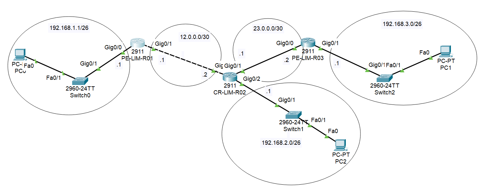

# Enterprise Static Routing Lab - Regional Lima

## 1. Descripción del Proyecto
Este repositorio documenta la implementación técnica de una arquitectura de red trinitaria (tres nodos) interconectada mediante **Enrutamiento Estático**. El diseño ha sido optimizado utilizando **VLSM** para una gestión eficiente del espacio de direccionamiento IP en un entorno corporativo simulado en Cisco Packet Tracer.

## 2. Topología de Red

## 3. Cuadro de Direccionamiento IP (VLSM)
| Dispositivo | Interfaz | Dirección IP | Máscara de Subred | Gateway |
| :--- | :--- | :--- | :--- | :--- |
| **PE-LIM-R01** | Gig0/0 (LAN) | 192.168.1.1 | 255.255.255.192 | N/A |
| **PE-LIM-R01** | Gig0/1 (WAN) | 12.0.0.1 | 255.255.255.252 | N/A |
| **CR-LIM-R02** | Gig0/1 (LAN) | 192.168.2.1 | 255.255.255.192 | N/A |
| **PE-LIM-R03** | Gig0/1 (LAN) | 192.168.3.1 | 255.255.255.192 | N/A |

## 4. Implementación Técnica y Hardening
La configuración de los dispositivos Cisco 2911 incluye estándares de seguridad y gestión profesional:
* **Seguridad de Acceso:** Uso de `enable secret` (MD5) y cifrado de contraseñas de línea mediante `service password-encryption`.
* **Gestión de Logs:** Activación de `service timestamps` para una auditoría precisa de eventos de red.
* **Convergencia:** Rutas estáticas configuradas para garantizar la bidireccionalidad del tráfico entre todos los segmentos LAN.

## 5. Estructura del Repositorio
* `/config`: Contiene los archivos de configuración (`.cfg`) extraídos de cada router.
* `Static-routing-Lab.pkt`: Archivo fuente para simulación en Cisco Packet Tracer.
* `diagram-topology-red.png`: Representación visual de la arquitectura física y lógica.

## 6. Resolución de Problemas (Troubleshooting)
Durante la implementación, se diagnosticaron y solventaron los siguientes incidentes:
* **Protocol Down en Enlaces WAN:** Se identificó falta de convergencia en el protocolo de línea, solucionado mediante el refresco de interfaces (`shutdown` / `no shutdown`) y verificación de encapsulación.
* **Fallas de Conectividad ICMP:** Se auditaron las tablas de enrutamiento para asegurar la simetría de las rutas de retorno en los nodos PE, logrando un éxito del 100% en las pruebas de ping finales.
---
**Autor:** Hurtado Chiroque Dennis Elmer  
**Institución:** Universidad Nacional del Callao (UNAC)  
**Fecha:** Marzo 2026
